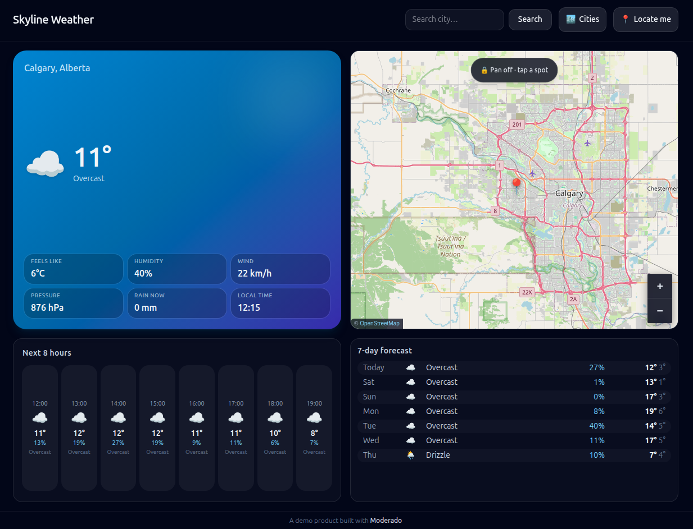

# How to Use Moderado — on this project

Moderado is the coding agent wired into this workspace (`weather-app-skyline`). Short version: ask for a change, get a change.

---

## 1. The one rule

**Never write files Moderado didn't explicitly tell you to create or modify.**

This bit me on day one. I asked for a "REDAME.md", Moderado wrote `README.md` instead — then a guard rejected the write outright because the prompt never named a literal file. When that happens the fix is trivial: re-issue the request naming the file exactly. It will go through.

Practical translation: if you want a file, name it. Don't describe it ("write the readme") — name it ("create README.md in the project root").

---

## 2. What Moderado can do

| Tool | Use it for | Example |
| --- | --- | --- |
| `list_files` | See what's here, recursive or shallow | "list the src tree" |
| `read_file` | Read a file, with offset/limit for big ones | "read server/index.js" |
| `search_files` | Grep across the workspace, literal or regex | "find every `useState` in src" |
| `edit_file` | Swap one exact snippet in one file | "replace this helper with …" |
| `apply_patch` | Same, batched across files | "apply these three edits" |
| `write_file` | Create a file or replace one wholesale | "create README.md" |
| `run_diagnostics` | `typecheck`, `lint`, `test` — the three scripts it knows | "run the typecheck" |
| `get_definition` / `find_references` | Jump to a symbol's type or usages | "where is `gradientFor` used" |
| `run_command` | Shell out (no shell parsing — argv array) | `["node","-v"]` |
| `git_diff` | Uncommitted changes, or a diff against a ref | "what's changed" |
| `web_search` | Anything that changes over time | "current weather in Lisbon" |
| `subagent` | Hand one bounded, self-contained sub-task off | "audit the cache TTLs" |

Note `run_command` runs **without a shell**. `["rm","-rf","dist"]` works. `["ls && rm -rf dist"]` does not — pass `&&` as its own argument, or just use two calls.

---

## 3. How to get good results

### Inspect before you edit

Moderado edits exactly what you point it at. If you reference code it hasn't read, it will read it first — but that costs a round trip. Naming the file and the function ("the `load` callback in `App.jsx`") gets you there in one.

### Be specific about scope

| Vague | Specific |
| --- | --- |
| "fix the map" | "the map doesn't recenter when a new place is selected" |
| "add caching" | "cache `/api/geocode` for 24h, weather for 1h, in the existing `cache` table" |
| "clean it up" | "replace the three `useEffect` polling timers in App.jsx with one" |

### State the constraint, not just the goal

The strongest prompts in this repo's history named the constraint explicitly — "no charting library", "no Express", "standard library first". That phrasing is what keeps the result at three runtime dependencies instead of nine.

### Let it verify

If you want a change *checked*, say so: "and run the typecheck." Diagnostics are a separate tool and won't run unless requested.

---

## 4. House style in this repo

Worth knowing so your next request doesn't fight it:

- **Three runtime deps:** `react`, `react-dom`, `leaflet`. Anything else needs a justification.
- **Node built-ins over packages:** `node:http` instead of Express, `node:sqlite` instead of better-sqlite3. No native build steps.
- **Draw it yourself when it's small:** the hourly chart is ~40 lines of SVG math. Weather icons are inline SVG. No icon font.
- **Normalise at the server boundary** (`normalizeWeather()`), so the React tree never sees provider quirks.
- **One state machine, in `App.jsx`.** Every entry point funnels into `load(place, {record})`.
- **Explicit failure states** — `loading | ready | error`, with a real message per failure mode. No silent blanks.
- **Zero commented-out code, zero `TODO`s.**

---

## 5. What Moderado won't do

- **Fabricate.** No invented tool names, no made-up API surface, no "the tests pass" without actually running them.
- **Bulk up.** No speculative abstractions, no wrapper around a single call site, no config knobs for things nobody changes.
- **Overwrite silently.** Existing files get read before they're touched; new files need explicit permission.
- **Reach for the network** when the standard library already has it.

If you want one of these anyway, ask directly — it will do what you say.

---

## 6. Quick recipes

**Add a feature**

> "Read `App.jsx` and `src/lib/api.js`, add a `GET /api/air` route on the server that proxies Open-Meteo air quality, and surface it as a new `Metric` tile."

**Fix a bug**

> "When a new place loads, the map keeps the old viewBox. Fix it in `WeatherMap.jsx` and confirm the fix reads cleanly."

**Understand something**

> "How does the caching TTL work end to end? Read `server/db.js` and `server/index.js`."

**Wrap things up**

> "Create README.md in the project root covering features, stack, setup, the API, and the design decisions."

**Check the build**

> "Run the typecheck and fix whatever it finds."

---

## 7. Running the app

```bash
npm install
npm start          # API + static server on :3001
npm run dev        # Vite on :5173, proxying /api → :3001  (separate terminal)
npm run build && npm start   # production
```

Node ≥ 22.5 required (`node:sqlite`). Verified on 24.21.0. No API keys.


## 8. Build the Weather App in 5 commands

Launch `Moderado`, select the Provider/Model: `OpenRouter` - `Stealth/space-bunny-alpha`.

1st Command:-

```text
Please write a Weather app, using React JS, Tailwind CSS and Realtime map (OpenStreetMap?) plus sqlite3 database if needed, with ability to detect current / local city and display its weather info by default.
```

The build takes 47s.

2nd Command:-

```text
Please prepare the README.md and run up the app.
```

The weather app is running at http://localhost:5173. It looks good, but I would fine tune a bit.

3rd command:-

```text
Please organize the 4 cards nicely as such no blank space is presented. then make the map card square-shaped and same size as the dash card; the hourly card in teh same size as the days card; And please make the app to mobile-device friendly.
```

4th command:-

```text
Make a function that a user can click a city and populate its weather into the app.
```

5th command:-

```text
CHange the title to be "Skyline Weather" and make a simple footer stating "a Demo Product Built with Moderado".
```

## 9. Screenshot of the Skyline Weather app



## License

MIT
